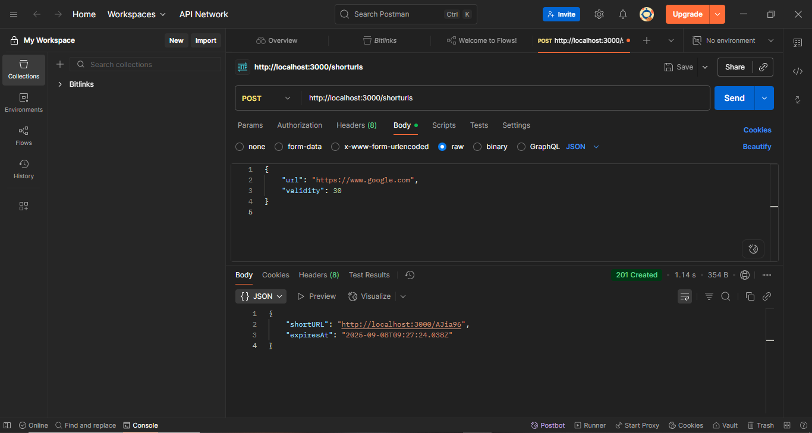
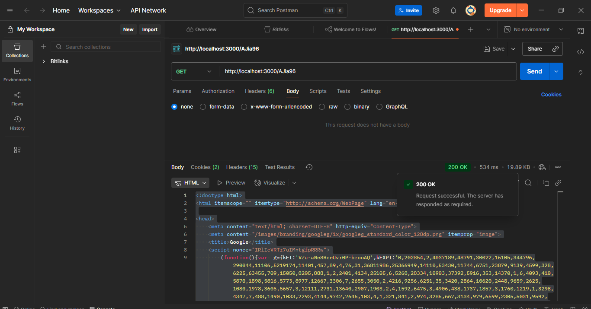

# URL Shortener Backend

## Description
A simple backend API to create short URLs, redirect, and view click stats. Built with Node.js and Express, with middleware to log requests.

## How to Run
1. Clone the repo and go to the backend folder:
```
cd URL_SHORTNER/backend
```

2. Install dependencies:
```
npm install
```

3. Start the server:
```
nodemon index.js
```

## API Endpoints

1. POST /shorturls – Create a short URL
2. Body (JSON): { "url": "https://www.google.com" }
3. GET /code – Redirect to original URL
4. GET /shorturls/code – Get stats of the short URL

# URL Shortener Backend

## Screenshots

### Create Short URL


### Redirect Short URL


